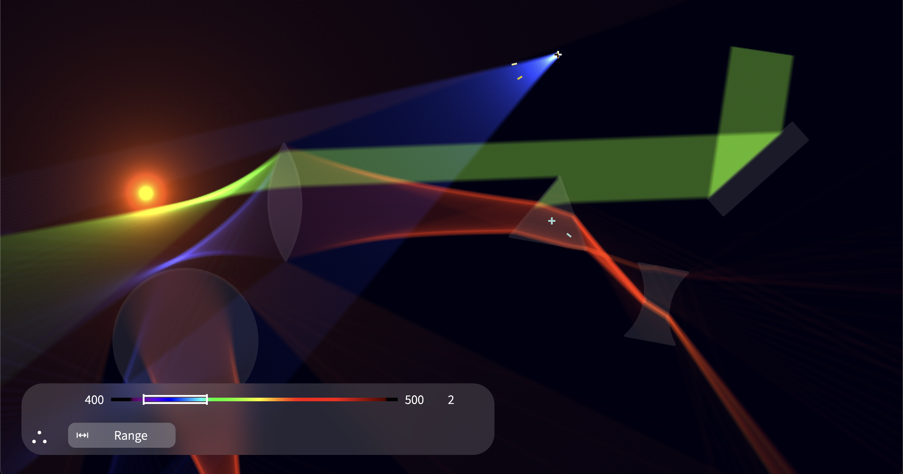

<h1 align="center"></h1>

Refraction is a web-based ray optics simulator. It handles rendering and configuration of certain elements through a seamless UI/UX experience.

## Development

To run locally:

1. [Install NodeJS and NPM](https://docs.npmjs.com/downloading-and-installing-node-js-and-npm).
2. Run `npm i` at the root of this project.
3. Run `npm run dev` at the root of this project.
4. Navigate to the printed address.

To build:

1. Follow run steps up to step 2.
2. Run `npm run build` at the root of this project.

## Features

### Glass

- Circle Glass: A circular piece of glass, defined by a center and radius.
- Convex Lens Glass: A convex lens, defined by two intersecting circles.
- Concave Lens Glass: A concave lens, defined by two non-intersecting circles and a certain length.
- Rectangle Glass: A rectangle-shaped glass, defined by a width, height, and angle.
- Polygon Glass: A polygon glass. Currently, only a triangle is supported. A custom polygon editor is in the works.

> [!NOTE]
> All glass elements have a material property, which can be selected as either vacuum, glass, or mirror. A custom editor for refractive index and absorption spectra is in the works.

### Light

- Point Light: A 360° spanning point light.
- Directional Light: A directional light, defined by a heading and angle spread.
- Plane Light: A plane light, defined by the plane length and angle.

> [!NOTE]
> All light elements have an emission configurator. They can emit either discrete points, a certain range of wavelengths with a static amplitude, or a continuous amplitude function. A graph editor is included for this option.

### Editor

Select the knobs of the elements to move, resize, and rotate them. Click on them to select them. Click <kbd>⌫</kbd> or <kbd>⌦</kbd> to remove elements.
